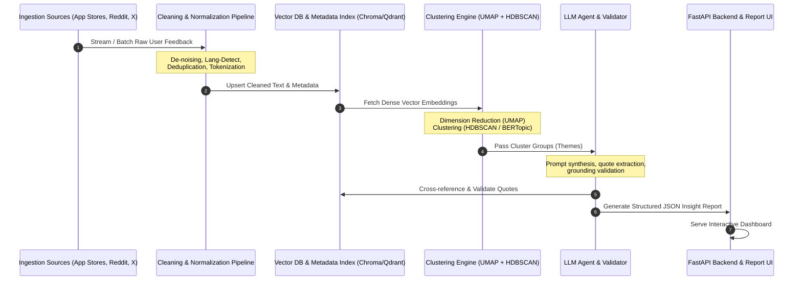
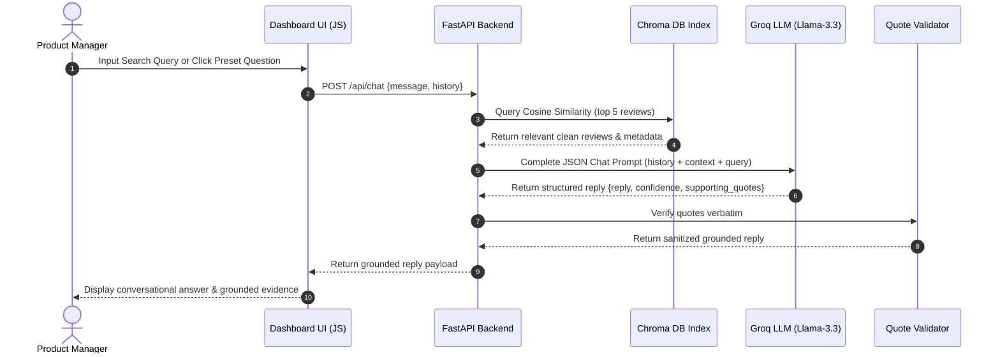

# Architecture Specification: AI-Powered User Discovery Engine

This document details the software architecture, data structures, and algorithmic workflows for the **AI-Powered User Discovery Engine** for Quick Commerce (e.g., Blinkit). The engine processes high volumes of unstructured feedback from app store reviews, social media, and community discussions to output validated behavioral insights.

---

## 1. Architectural Blueprint

The system is designed as a modular pipeline with three main layers: **Data Acquisition & Normalization Layer**, **Semantic Analysis & AI Layer**, and the **Insight Delivery & API Layer**. 

### 1.1 High-Level Component Interaction



---

## 2. Technical Stack Recommendations

The recommended, lightweight, and scalable stack for implementing this engine is outlined below:

| System Layer | Component / Tool | Technology Option | Rationale |
| :--- | :--- | :--- | :--- |
| **Data Ingestion** | Scrapers / APIs | Python (`PRAW` for Reddit, `google-play-scraper` / `app-store-scraper`) | Specialized, robust open-source wrappers for public APIs. |
| **Preprocessing** | Cleaning Pipeline | `Pandas`, `Langdetect`, `NLTK`/`spaCy` | Efficient text cleaning, standard tokenization, and language filtering. |
| **Vector Space** | Embedding Model | `BAAI/bge-small-en-v1.5` (via SentenceTransformers) | Local, fast, and highly performant embedding representation. |
| **Database** | Vector DB | `ChromaDB` or `Qdrant` | In-memory/embedded testing with production-ready vector query support. |
| **Clustering** | Dimensionality & Topic Modeling | `UMAP` + `HDBSCAN` / `BERTopic` | Advanced unsupervised density-based clustering; robust to noise. |
| **LLM Orchestration**| Inference & Prompting | `Groq` (`llama-3.3-70b-versatile`) | JSON mode support. Throttled by limits (30 RPM, 1K RPD, 12K TPM, 100K TPD). |
| **Validation** | Quote Validator | Python String Match / TF-IDF | Hard-matching validation to prevent hallucination in quotes. |
| **Backend & API** | REST API | `FastAPI` + `Pydantic` | Modern, high-performance web framework for serving report endpoints. |

---

## 3. Deep-Dive Pipeline Architecture

### 3.1 Data Ingestion & Normalization Pipeline
The system collects raw texts from multiple scrapers. Normalization cleans the input stream to construct the canonical dataset.

```
       +---------------------------------------------+
       |             Raw Feed Ingestion              |
       |  (Reddit, Play Store, App Store, X, Forums) |
       +---------------------------------------------+
                              |
                              v
       +---------------------------------------------+
       |             Language Detection              |  --> Discard Non-English
       |           (Filter English / Hinglish)       |
       +---------------------------------------------+
                              |
                              v
       +---------------------------------------------+
       |             Noise & Length Filter           |  --> Discard short comments (< 5 words)
       |           (Strip Ads, Bot Signatures)       |      or spam patterns
       +---------------------------------------------+
                              |
                              v
       +---------------------------------------------+
       |           Deduplication Engine              |  --> Hash raw text; drop
       |           (MinHash / SimHash)               |      cross-platform duplicates
       +---------------------------------------------+
                              |
                              v
       +---------------------------------------------+
       |            Standardized Payload             |
       |  (Cleaned text, Timestamp, Platform, Anon)  |
       +---------------------------------------------+
```

### 3.2 Semantic Clustering & Topic Modeling Engine
The cleaned dataset is converted into vector embeddings. Dense clusters represent organic customer feedback themes.

1. **Embedding Generation**: Convert text payloads into dense semantic vectors using the local `BAAI/bge-small-en-v1.5` embedding model via SentenceTransformers.
2. **Dimension Reduction (UMAP)**: Reduce vectors to 5–10 dimensions to prepare data for density-based clustering.
   * *Parameters*: `n_neighbors = min(15, total_records - 1)` (to prevent crashes on small datasets), `n_components=5`, `metric='cosine'`.
3. **Density Clustering (HDBSCAN)**: Group documents in the reduced vector space. Unclustered documents are labeled as noise (`-1`).
   * *Parameters*: Dynamically scaled based on the count of clean records ($N$):
     * If $N < 100$: `min_cluster_size = 3`, `min_samples = 1`
     * If $100 \le N < 1000$: `min_cluster_size = 10`, `min_samples = 3`
     * If $N \ge 1000$: `min_cluster_size = 15`, `min_samples = 5`
     * Metric: `'euclidean'`.

### 3.3 LLM-Powered Insight Agent
Once clusters are generated, the documents in each cluster are sampled and passed to the LLM alongside a strict system prompt to synthesize qualitative summaries.

#### Core Prompt Strategy:
* Provide the LLM with the cluster's high-frequency terms, top 20 representative documents (closest to the cluster centroid), and metadata.
* Instruct the LLM to output a structured JSON schema mapping user motives, frictions, quotes, and product opportunities.

#### Pydantic Schema for Insight Extraction:
```python
class UserQuote(BaseModel):
    text: str
    source_platform: str
    timestamp: str

class BehavioralInsight(BaseModel):
    theme_name: str
    summary: str
    user_motivations: List[str]
    pain_points: List[str]
    product_opportunities: List[str]
    supporting_quotes: List[UserQuote]
    confidence_score: float  # Scale of 0.0 to 1.0
```

---

## 4. Confidence & Validation Framework

To ensure that the engine outputs highly reliable insights that product managers can trust, the architecture incorporates two validation mechanisms:

### 4.1 Strict Hallucination Guard (Quote Validation)
The engine automatically cross-references every LLM-generated quote against the raw canonical database:
* **Algorithm**: Runs a substring search or a Levenshtein distance check (threshold $\ge 95\%$ match) between the generated quote and the original raw documents in the cluster.
* **Fallback**: If a quote fails validation, it is rejected and replaced with the closest matching verbatim sentence from the source database, or flagged for omission.

### 4.2 Confidence Score Heuristic
The engine calculates a statistical confidence score ($C$) for each identified behavioral theme using the following variables:
* $S$: Cluster size (number of feedback entries).
* $D$: Platform diversity (number of distinct platforms represented in the cluster).
* $V$: Vector density (average cosine similarity to cluster centroid).

$$C = w_1 \cdot \min\left(1.0, \frac{S}{100}\right) + w_2 \cdot \left(\frac{D}{D_{\max}}\right) + w_3 \cdot V$$

*Where $w_1 = 0.4$, $w_2 = 0.3$, $w_3 = 0.3$ represent weights totaling $1.0$.*

---

## 5. User Segmentation & Opportunity Matrix

### 5.1 Classification Rules
A downstream classifier (either a fast zero-shot classifier or LLM router) maps clean feedback records to target user segments:
* **Mission-driven shoppers**: High search frequency, short session duration, low category exploration.
* **Habitual repeat buyers**: Purchases from the same 1–2 categories in the last 5 orders.
* **Exploratory shoppers**: High rate of viewing new categories, adds variety to cart.
* **Price-sensitive users**: Filters by lowest price, high usage of discount coupons/codes.

### 5.2 Insight Synthesis (Unmet Needs Matrix)
The backend correlates the discovered themes against the classification tags to generate an **Opportunity Score**:

$$\text{Opportunity Score} = \text{Pain Severity (LLM)} \times \text{Segment Reach (Frequency)}$$

*The product opportunity dashboard ranks these items to highlight high-impact changes (e.g., adding social proof reviews for beauty products to convert habitual grocery buyers).*

---

## 6. Security, Privacy & Compliance (GDPR/DPDP)

As the system ingests public reviews and social media comments, it enforces strict data privacy rules:
* **PII Redaction**: Pre-processing includes a regex and Named Entity Recognition (NER) pipeline using `spaCy` to redact potential PII (Phone numbers, emails, addresses, names, or UPI IDs/credit card digits).
* **Anonymization**: User IDs and authors are hashed (e.g., using SHA-256 with a salt) or generalized (e.g., `RedditUser_482c`) before database storage.
* **No Private Ingestion**: No internal transaction or private profile data is stored in the public discovery database.

---

## 7. Conversational RAG Chatbot Engine

The system features an interactive **Conversational Retrieval-Augmented Generation (RAG)** chatbot allowing user query search threads.

### 7.1 Architecture Workflow


### 7.2 JSON Response Schema
All `/api/chat` requests resolve into the following structured JSON format:
```json
{
  "reply": "A detailed conversational answer responding to the user's query, synthesized from the retrieved feedback logs.",
  "confidence": "High / Medium / Low",
  "supporting_quotes": [
    {
      "text": "Verbatim quote text",
      "source_platform": "play_store/app_store/reddit",
      "timestamp": "ISO-timestamp"
    }
  ]
}
```
