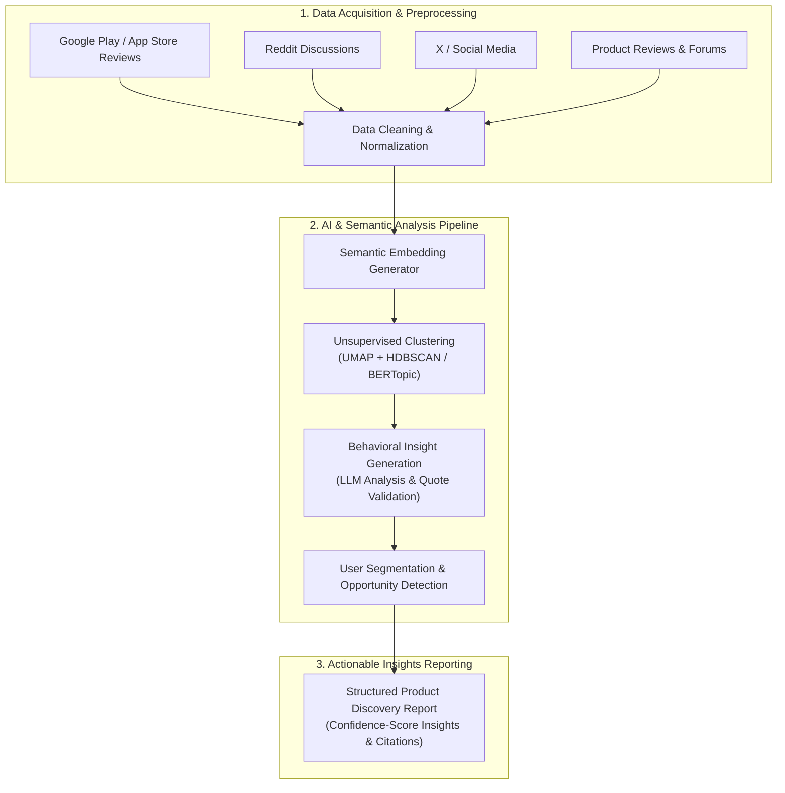

# Problem Statement: AI-Powered User Discovery Engine for Quick Commerce

## 1. Executive Summary
Quick commerce platforms like **Blinkit** have revolutionized the convenience economy by mastering ultra-fast delivery (10-minute delivery model). However, a key growth challenge remains: users frequently default to **"habitual shopping"** (purchasing the same narrow set of categories, such as milk, fresh produce, and staples) rather than exploring other high-margin or diverse categories (e.g., electronics, beauty, home decor, or artisanal items). 

To drive sustainable growth, increase Average Order Value (AOV), and build customer lifetime value, the platform must transition from being a utility-first app to a **discovery-first platform**. 

The **AI-Powered User Discovery Engine** is designed to automatically ingest, clean, and synthesize massive volumes of unstructured user feedback from multiple public channels. By leveraging Large Language Models (LLMs), semantic vector spaces, topic modeling, and clustering, the system replaces manual surveys and analysis with a scalable, validated, and explainable product insight framework.

---

## 2. System Architecture & Pipeline Workflow

The workflow of the Discovery Engine flows through three primary stages: data ingestion and normalization, semantic analysis, and synthesized reporting.

---

## 3. Core Objectives & Research Questions
The system must replace manual qualitative UX research with an automated, explainable discovery workflow. It is designed to continuously answer key strategic questions:

* **Category Inertia:** Why do users repeatedly buy from the same product categories?
* **Exploration Barriers:** What psychological or functional friction prevents users from trying new categories on a quick-commerce platform?
* **Discovery Paths:** How do users find products? Is it through search, banners, or external word-of-mouth?
* **The Habit Loop:** What specific role do routines and daily habits play in locking shopping behavior?
* **Information Thresholds:** What specific information (e.g., reviews, video demos, origin stories) do users require before trusting a new category for 10-minute delivery?
* **Recurrent Friction:** What frustrations (quality concerns, packaging, price perception) emerge repeatedly across discussions?
* **User Segmentation:** Which user segments show a higher propensity for experimentation?
* **Unmet Needs:** What product gaps or service needs are consistently discussed but currently unaddressed?

---

## 4. Ingestion Data Sources
To build a 360-degree view of the quick-commerce consumer, the engine ingests public, user-generated content from:
1. **App Ecosystems:** Google Play Store and Apple App Store reviews for Blinkit and its competitors.
2. **Social Communities:** Reddit (e.g., r/india, r/bangalore) and niche community/hobbyist forums.
3. **Social Media:** Real-time discussions and trends on X (formerly Twitter), Instagram, and Facebook.
4. **Web Feedback:** Product review websites, quick-commerce discussions, and public blog comments.

*Note: The ingestion layer is modular, allowing future data sources to be integrated without altering downstream analysis pipelines.*

---

## 5. Functional Pipeline Components

### 5.1 Multi-source Data Collection
Collects recent discussions from configured public channels. Each ingestion record captures:
* `Source`, `Timestamp`, `Author` (anonymized), `Platform`, `Raw Text`, and associated `Metadata`.

### 5.2 Data Cleaning & Normalization
Cleans the raw text to ensure high-fidelity inputs for downstream models. Cleaning steps include:
* Removing spam, duplicate posts, and advertisements.
* Detecting language and discarding non-relevant discussions.
* Filtering out extremely short comments.
* Standardizing text formatting.

### 5.3 Semantic Understanding & Topic Modeling
Processes cleaned text into semantic vectors:
* Generates dense vector embeddings for all posts.
* Uses clustering techniques (e.g., UMAP + HDBSCAN or BERTopic) to identify natural, unsupervised themes without predefined labels.
* **Example Themes:** Habit-driven shopping, trust issues, discovery friction, price sensitivity, category awareness, recommendation quality, search-first behavior, convenience-driven purchases.

### 5.4 Behavioral Insight Generation
For every discovered theme, an LLM generates a comprehensive summary:
* **Theme Name** & **Theme Summary**
* **Representative User Quotes** & **Supporting Evidence**
* **User Motivations** & **Pain Points**
* **Product Opportunities** & **Confidence Score**

### 5.5 User Segmentation
Automatically classifies discussions into behavioral segments to identify which cohorts are more likely to explore new categories:
* *Mission-driven shoppers*, *Habitual repeat buyers*, *Exploratory shoppers*, *Price-sensitive users*, *Convenience-first users*, *Brand-loyal customers*, *Trust-conscious buyers*.

### 5.6 Opportunity Detection
Identifies actionable product and growth opportunities based on unmet customer needs, including:
* Lack of category awareness.
* Low trust in new categories.
* Poor quality recommendations / weak personalization.
* High search dependency / decision anxiety.
* Need for social proof / cross-category discovery opportunities.

---

## 6. Output & Deliverables
The system delivers customer insights through two primary dashboard components:
1. **Product Discovery Report**: A structured overview containing:
   * **Executive Summary:** High-level findings from all channels.
   * **Major Themes:** Top recurring customer behavioral themes.
   * **User Pain Points:** Common frustrations and friction loops.
   * **Product Opportunities:** Ranked opportunities based on reach and severity.
   * **Confidence Level:** Statistical score validating each insight.
2. **Conversational RAG Chatbot**: An interactive search interface where product managers can query customer feedback in natural language.
   * **Preset Research Queries:** Offers clickable triggers for the 8 core research questions.
   * **Conversational Memory:** Preserves multi-turn chat context.
   * **Grounded Citations:** Directly embeds validated verbatim customer quotes beneath each AI response.

---

## 7. Quality Validation Guidelines
To maintain explainability and avoid LLM hallucinations:
* **Quote Validation:** Every generated quote must be validated and matched back to the original source text.
* **Confidence Scoring:** Assign confidence scores based on source frequency and cross-platform consistency.
* **Handling Conflict:** Highlight conflicting user opinions rather than forcing consensus.
* **Deduplication:** Remove cross-platform duplicate posts.
* **Explainability:** Maintain clear source attribution trace paths for every insight.

---

## 8. Non-Goals (Scope Boundaries)
The initial scope of the engine excludes:
* Automatically recommending specific software/product features.
* Analyzing private customer transaction or personal profile data.
* Real-time social media listening and immediate alert triggering.
* Predicting future user behavior.
* Replacing primary user research or direct usability testing.
